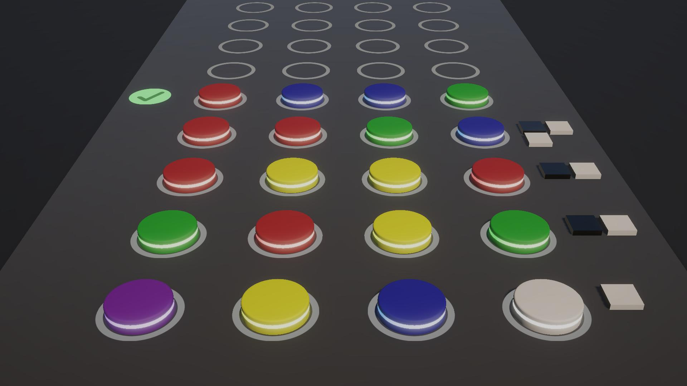

<h1>Re-MasterMind-ed 🧠</h1>

  A remastered version of the classical code-breaking game Mastermind.

  

<h2>How to Play</h2>

  When starting a new game the computer generates a random code pattern of 4 colors.
  The colors are chosen from a pool of 6 different colors in total and may occur multiple times in the code pattern.
  It is the users task to find out which pattern was chosen by trial and error.
  The user has a total of 12 guesses to break the code.
  After every guess it is revealed how many guessed colors were correct.
  This is indicated by 4 small indicators next to the respective guess-pattern.
  A black indicator means a color was guessed correctly and also placed in the correct position.
  A white indicator reflects a correct color, but in the wrong position.

